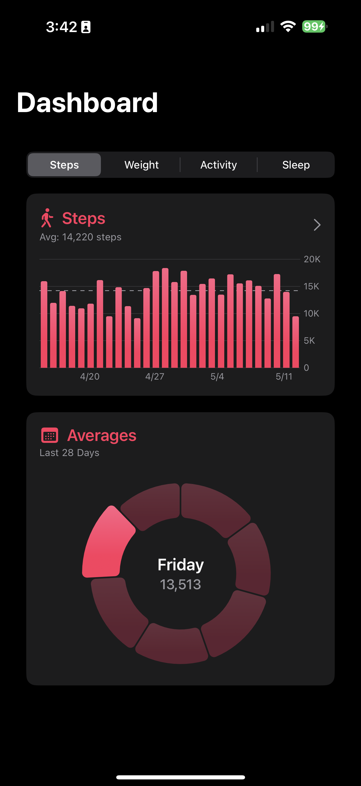
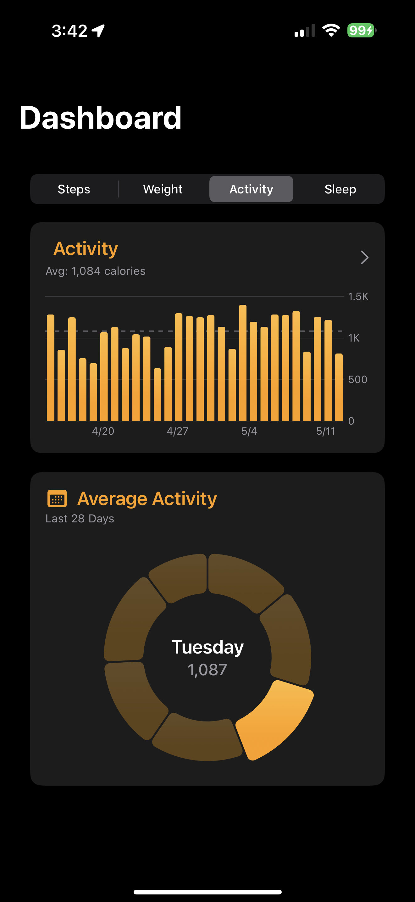
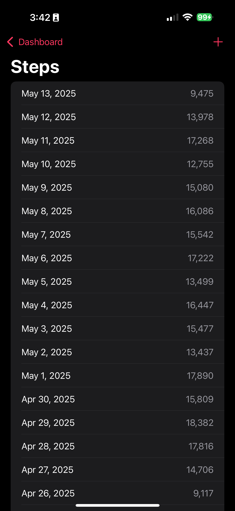
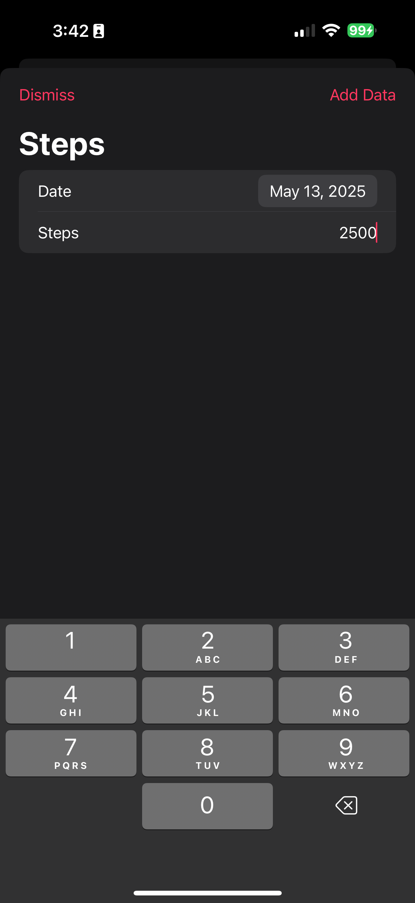

# Step Tracker

## Overview
Step Tracker is an iOS portfolio application that integrates with Apple HealthKit to track and visualize your daily step count and other health metrics. The app provides interactive charts and detailed analytics to help you monitor your activity and make informed health decisions.

## Features
- **HealthKit Integration**: Seamlessly connects with Apple Health to access and display your step data
- **Interactive Charts**: Visualize your steps and other health metrics with beautiful, interactive Swift Charts
- **Daily Analytics**: See your daily step count and progress toward your goals
- **Historical Data**: Track your steps over time with comprehensive historical views
- **Trend Analysis**: Identify patterns in your activity with weekly and monthly trend analysis
- **Sleep Analysis**: Analyse your sleep patterns to spot trends in your sleep scores

## Demo Video


## Screenshots
### Steps Dashboard


### Weight Dashboard


### Activity Dashboard


### Steps List View


### Add Custom Data


## Technologies Used
- Swift
- SwiftUI
- HealthKit
- Swift Charts
- Swift Algorithms
- MVVM architecture

## Installation
1. Clone the repository:
   ```
   git clone https://github.com/cshireman/step-tracker.git
   ```
2. Open the project in Xcode:
   ```
   cd step-tracker
   open StepTracker.xcodeproj
   ```
3. Configure HealthKit capabilities in Xcode:
   - Select the project file in the navigator
   - Select your app target
   - Go to "Signing & Capabilities"
   - Click "+ Capability" and add "HealthKit"

4. Build and run the application on your device or simulator.

## Usage
1. Launch the app
2. Grant HealthKit permissions when prompted
3. View your current step count on the main dashboard
4. Explore different chart views to analyze your activity patterns
6. Check historical data to track your progress over time

## Architecture
The app follows the MVVM (Model-View-ViewModel) architecture pattern:
- **Models**: Data structures that represent health metrics and user preferences
- **Views**: SwiftUI views that display the user interface
- **ViewModels**: Classes that manage data flow and business logic between models and views

## Future Enhancements
- Support for additional health metrics (VO2Max, distance, etc.)
- Custom notifications and reminders
- Social sharing capabilities
- Health insights and recommendations
- Widget support

## Requirements
- iOS 16.0+
- Xcode 14.0+
- Swift 5.7+
- iPhone with HealthKit support

## Contact
- Developer: Christopher Shireman
- GitHub: [@cshireman](https://github.com/cshireman)
- LinkedIn: [Christopher Shireman](https://www.linkedin.com/in/christophershireman/)

## License
This project is licensed under the MIT License - see the LICENSE file for details.
